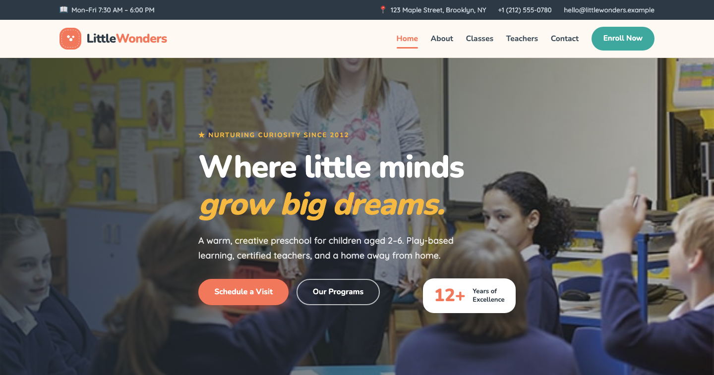

# Little Wonders — Preschool & Daycare Template

A premium, framework-free HTML template for a preschool and daycare center. Warm coral with teal and golden accents on soft cream grounds, driven by Nunito rounded display type and Quicksand body text — a friendly, trusting presence for a school where children aged 2–6 explore, create, and grow.

## 📸 Screenshot

## Design System

| Token | Value |
|-------|-------|
| **Ground** | `--clr-cream` `#fef9f2` (light), `--clr-dark` `#1f2a33` (dark) |
| **Primary** | `--clr-coral` `#f2785c` (warm coral), `--clr-coral-deep` `#e05c3f` |
| **Secondary** | `--clr-teal` `#3fa89e`, `--clr-teal-deep` `#2e8a81` |
| **Accent** | `--clr-gold` `#f5b942` |
| **Surface** | `--clr-card` `#ffffff`, `--clr-sand` `#faf1e5`, `--clr-line` `#ece4d8` |
| **Text** | `--clr-ink` `#2d3a45`, `--clr-text` `#5b6b77`, `--clr-muted` `#8b98a3` |
| **Display type** | `Nunito` (400–800) |
| **Body type** | `Quicksand` (400–700) |
| **Container** | 1200px max-width, centered |
| **Breakpoints** | ~992px, ~768px, ~576px |

## Pages

| Page | File | Description |
|------|------|-------------|
| Home | [index.html](index.html) | Crossfading hero with experience badge, six-feature ribbon, story split, six class cards, enrollment form, teachers, gallery, testimonials, blog, CTA |
| About | [about.html](about.html) | Story since 2012, stats band, three values, tour band |
| Classes | [classes.html](classes.html) | Six age-grouped program cards with schedules and tuition, transparent pricing split |
| Teachers | [teachers.html](teachers.html) | Four teacher cards with credentials, hiring band, "why it matters" split |
| Contact | [contact.html](contact.html) | `[data-form]` contact form with subject select, info list, map frame |
| 404 | [404.html](404.html) | On-brand error page with recovery links |

## Features

- **Framework-free** — pure HTML5, CSS3 (custom properties, Grid, Flexbox, `clamp()`), vanilla JavaScript
- **Playful preschool aesthetic** — coral + teal + gold on cream, rounded shapes and friendly type
- **Fluid responsive** — three breakpoints, no horizontal scroll on any viewport
- **Scroll reveal** — IntersectionObserver-powered `.reveal` animations (respects `prefers-reduced-motion`)
- **Mobile nav** — burger toggle with `aria-expanded` accessible pattern
- **Hero crossfade** — automatic 6s background image transition via `.hero-bg img` + `.active`
- **Hero badge** — overlapping "12+ years" floating credential
- **Feature ribbon** — six-icon trust strip under the hero
- **Class cards** — age tag, schedule, session time, transparent monthly tuition
- **Enrollment form** — `[data-form]` hook with `.form-ok` / `.form-err` / `.show` toggle
- **Teacher cards** — portrait with social overlay, role, and credentials
- **Gallery grid** — six activity photos with lightbox-style full-size links
- **Testimonial cards** — avatar, name, role and quote
- **Blog grid** — post cards with category, image and teaser
- **Newsletter** — footer sign-up form with validation feedback
- **Original imagery** — classroom, craft and garden photography, no placeholders

## Tech Stack

- HTML5 + CSS3 (W3C-valid, semantic landmarks)
- Vanilla JavaScript (canonical IIFE build)
- Google Fonts (Nunito + Quicksand)
- SVG favicon (inline data: URI)

## SEO

- Semantic HTML5 structure (`<header>`, `<nav>`, `<main>`, `<section>`, `<footer>`)
- Unique `<title>` and `<meta description>` per page
- `lang="en"` attribute, `charset="utf-8"`, viewport meta
- Alt text on all images

## License

Free for personal and commercial use. Attribution appreciated but not required.

---

## Let's Build Something Together 🚀

[Book a free consultation](https://tally.so/r/q4q1L9)
